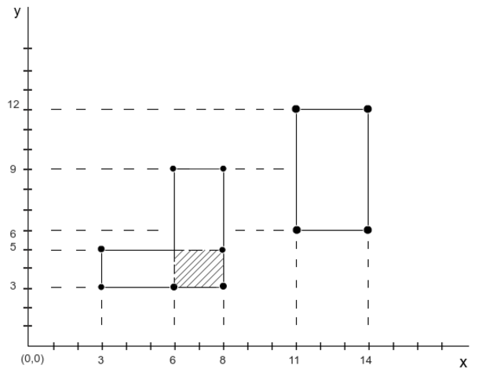

# Kata: [\[Total area covered by rectangles\]](https://www.codewars.com/kata/55dcdd2c5a73bdddcb000044)

**Rank:** 3-kyu

## Problem Description
Your task in order to complete this Kata is to write a function which calculates the area covered by a union of rectangles.
Rectangles can have non-empty intersection, in this way simple solution: Sall = S1 + S2 + ... + Sn-1 + Sn (where n - the quantity of rectangles) will not work.

### Preconditions
 - each rectangle is represented as: [x0, y0, x1, y1]
 - (x0, y0) - coordinates of the bottom left corner
 - (x1, y1) - coordinates of the top right corner
 - xi, yi - positive integers or zeroes (0, 1, 2, 3, 4..)
 - sides of rectangles are parallel to coordinate axes
 - your input data is array of rectangles

### Requirements
 - Number of rectangles in one test (not including simple tests) range from 3000 to 15000. There are 10 tests with such range. So, your algorithm should be optimal.
 - Sizes of the rectangles can reach values like 1e6.

There are three rectangles:
 - R1: [3,3,8,5], with area 10
 - R2: [6,3,8,9], with area 12
 - R3: [11,6,14,12], with area 18
 - R1 and R2 are overlapping (2x2), the grayed area is removed from the total area

Hence the total area is 10 + 12 + 18 - 4 = 36
